# Microsoft 365 and Graph Code Sample - Meeting Capture

## Overview

This sample code demonstrates how to create a real world line of business application with Office 365 services and the Microsoft Graph API.  The application in this sample includes components that run in Microsoft Teams, Outlook, and inside SharePoint Framework web parts.

The sample application makes setting up, attending, and following up on meetings easy and productive.

To see an end to end demonstration of the functionality in this sample, watch [this video](https://youtu.be/i2dqLM_ciUA).

## Prerequisites

- Install the following PowerShell modules
   - [Microsoft Graph PowerShell SDK](https://github.com/microsoftgraph/msgraph-sdk-powershell)
   - [SharePoint PnP](https://github.com/SharePoint/PnP-PowerShell#installation)
   - [Azure](https://docs.microsoft.com/en-us/powershell/azure/install-az-ps?view=azps-3.1.0)
- Install .Net Core 3.0 SDK and a text editor like Visual Studio or Visual Studio Code
- Install Node.js [Download](https://nodejs.org/en/download/)
- Create a custom domain name.
   - Please read the notes about the **customHostname** parameter in the **Deploy the ARM Template with PowerShell** section in this document.  It provides more details and context regarding the custom domain name.
   - There are free short-term domain name services available on the Internet, like https://www.freenom.com/ where you can get a free custom domain name.
- Office 365 Tenant and a Global Admin account
- Azure Subscription and an Admin account

## Installation summary

We've automated as much of the installation process as possible with PowerShell and an ARM template.  At a high level, here are the steps.  To install the sample, follow the steps in the next section, **Deployment Steps**.

1. Register for the Actionable Email Developer Dashboard
1. Clone the code in this repository to your local environment.
1. Create the AAD Application with the New-Application method in the Microsoft.Graph.Beta.Identity.Application module in MSGraph-SDK-PowerShell.
1. Deploy the ARM Template with the PowerShell Azure (Az) Module to create all the resources in Azure and configure the Logic app.
1. Compile the server code with Visual Studio 2019 or VS code, then deploy the dotnet core Web Site and Web Job.
1. Create the Teams App and deploy it.
1. Create tabs for the Meeting Capture web app and the Pending Meetings SPFx web part. 
1. Compile the SharePoint SPFx web part with npm and package it into a SharePoint package (sppkg), then deploy it to the SharePoint App Catalog with the PNP PowerShell module.

## Deployment steps

1. Register for the Actionable Email Developer Dashboard
   - Login to the Actionable Email Developer Dashboard [registration page](https://outlook.office.com/connectors/oam/publish/New) with an Office 365 account. Fill in the form and submit it.  Reference the table and screenshot below as you fill out the form.

   | Item | Description |
   | -----| ----------- |
   | Friendly Name | Feel free to fill in whatever you want here. |
   |Sender email address|Office 365 email account used to send Actionable Messages|
   |Target URLs|SharePoint site for storing documents in the Office 365 account|
   |Scope of submission|Select Organization|

   - Make sure you **Check** the App Developer Agreement, and click the **Save** button to submit the form.
      
   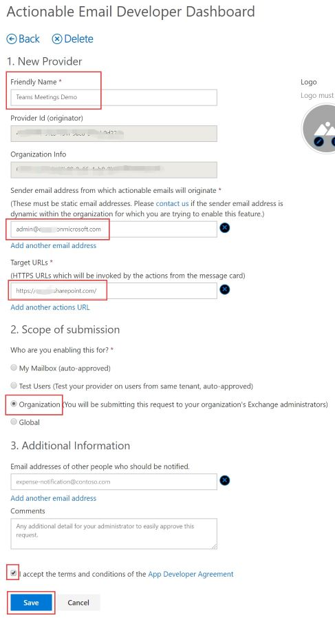

   - In the tenant where you configured the Actionale Email Developer Dashboard, log in to the Office 365 Tenant administrator's email and find the registration confirmation email. Record the following information:
      
   | Item | Key |
   | ---- | ----|
   | Provider Id (originator) | **originatorId** |
   | Sender email address from which Actionable Emails will originate | **EmailSender** |

   

1. Clone the code in this repository to your local environment.

1. Create the AAD Application
   - Open a PowerShell terminal and make sure you **Run as Administrator**.
   - Change to the directory where you cloned the code.
   - Change to the **Deployment** directory.
   - Run the PowerShell command `Connect-Graph`.
   - Run the script `.\NewApp.ps1`.  When prompted, enter the name of the application you plan to create in AAD, and the custom domain you prepared. When the script finishes running, record the following return values. You will use them in subsequent steps.
      - **Tenant Id**
      - **Client Id**
      - **Client Secret**
      - **App IdentifierUri**
   - Login to the [Azure Portal](https://portal.azure.com). Open **Azure Active Directory**. In **App registrations**, find the AAD application the script created. In the **API permissions** page, click **Grant admin consent for ...** to grant consent to use the permissions.

   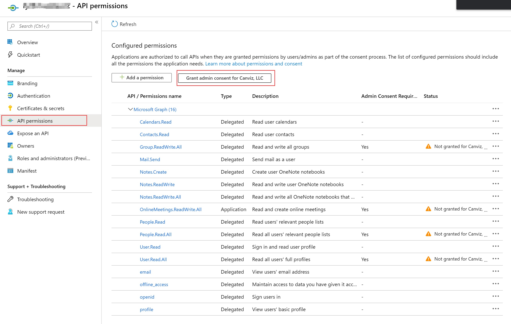

1. Deploy the ARM Template with PowerShell
   - Open the `ARMParameters.json` file and update following values.

   | Key  | Description |
   | ---- | ----------- |
   | webAppName | Free, but must be globally unique, 2-60 characters, valid characters include 0-9, a-z, A-Z, and _. If you enter the name fy19demo, the default web site url will be https://fy19demo.azurewebsites.net |
   | customHostname | This parameter is the custom domain name you created in the prerequisites section. For example, if you created a custom host named **mygreatdemo.tk** then you would enter mygreatdemo.tk for this parameter. **Note:** Before deploying the ARM template, you need to create a CNAME record in DNS to map the custom domain name to the webAppName name parameter (listed above). For example, if you use *fy19demo* for the webAppName parameter then the default web site name will be *fy19demo.azurewebsites.net*. Therefore, you need to create a CNAME in DNS to map the customHostname parameter to *fy19demo.azurewebsites.net*.
   | sqlAdministratorLogin | SQL Server administrator account name. |
   | sqlAdministratorLoginPassword | SQL Server administrator password. |
   | sqlDatabaseName | SQL Server database name |
   | actionMessageOriginatorId | **originatorId** generated in step Register for Actionable Email Developer Dashboard |
   | clientId | **Client Id** generated in the Create the AAD Application step. |
   | clientSecret | **Client Secret** generated in the Create the AAD Application step. |
   | tenantId | **Tenant Id** recorded in the Create the AAD Application step. |

   - Run the Powershell command `Connect-AzAccount`.
   - Run the script `.\DeployTemplate.ps1`. When prompted, enter the name of the resource group to create.
   - Since Teams does not support http access, we need to add SSL/TLS certificates to the custom domain. If the custom domain already has a certificate, you can follow the official Microsoft documentation [here](https://docs.microsoft.com/en-us/azure/app-service/configure-ssl-bindings#secure-a-custom-domain). If you don't have a certificate, you can follow [this process](https://github.com/sjkp/letsencrypt-siteextension/wiki/How-to-install) to create one and secure your custom domain with it.
   - Login to the [Azure Portal](https://portal.azure.com). Find the resource group the script just created. 
   - In the resource group, locate the Logic app resource named **SendActionMessage** and click it.
   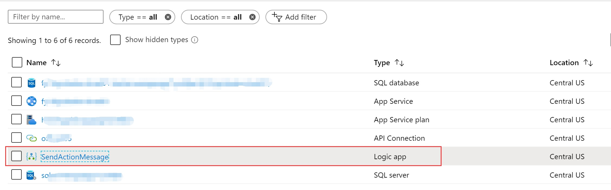
   - Click **Edit** on the top menu.
   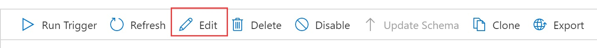
   - Select the **Connections** step and click **Add new** to update the email to the **EmailSender** value you recorded in the **Register for the Actionable Email Developer Dashboard** step.
   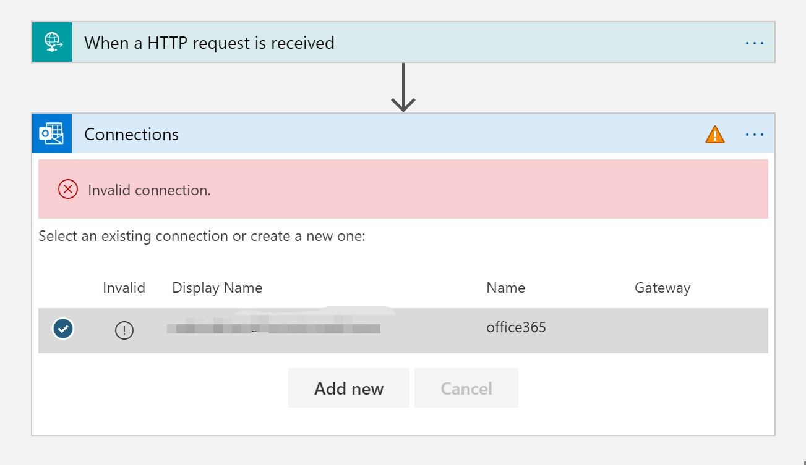
   - Click **Save** .
   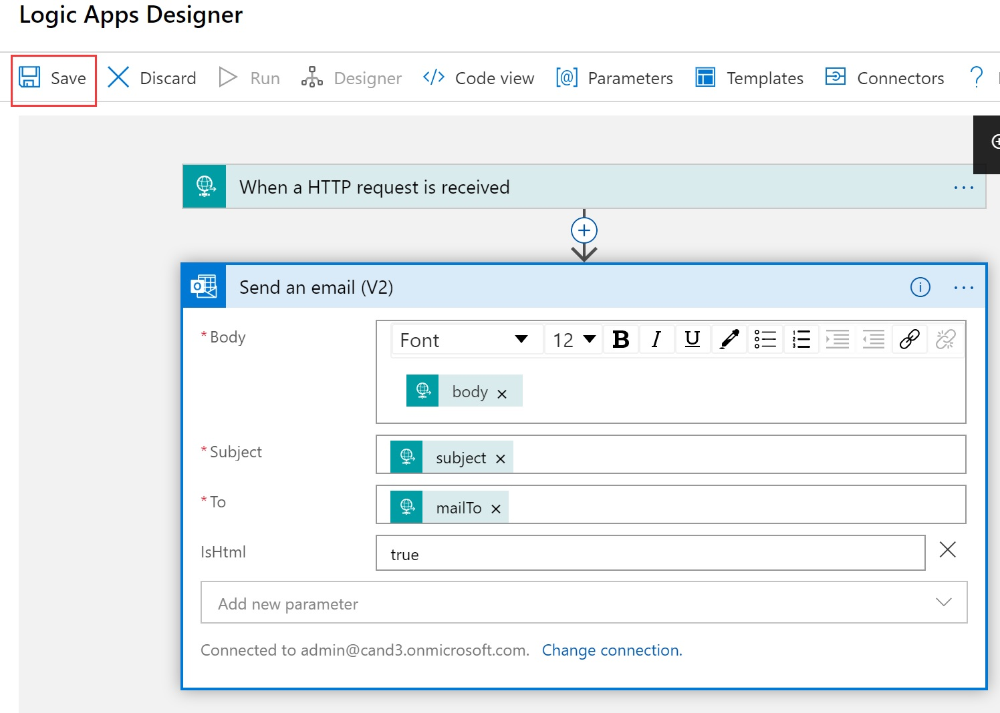

1. Compile and deploy the server code
   - In the command line, change to the **.\Source\FY19GraphShowcaseDemo** directory.
   - Run the script `.\PublishWebapp.ps1`. When prompted, enter the same resource group name and webAppName you entered in previous steps.

1. Create the Teams App
   - In the command line, change to the **.\Source\FY19GraphShowcaseDemo\MeetingCaptureWebApp\Manifest** directory.
   - Open the `manifest.json` file with a text editor.
   - Update following values.

      | **Key**                      | **Value**                   | **Description**                                              |
      | ---------------------------- | --------------------------- | ------------------------------------------------------------ |
      | **configurationUrl**         | https://{customHostname}/configure/ | Replace {customHostname} with your customHostname value. |
      | **validDomains**             | **customHostname**          | The same customHostname value used in previous steps. |
      | **webApplicationInfo.id**    | **Client Id**               | This value is generated in step **Create the AAD Application**. |
      | **webApplicationInfo.resource**  | **App IdentifierUri**       | This value is generated in step **Create the AAD Application**. |

      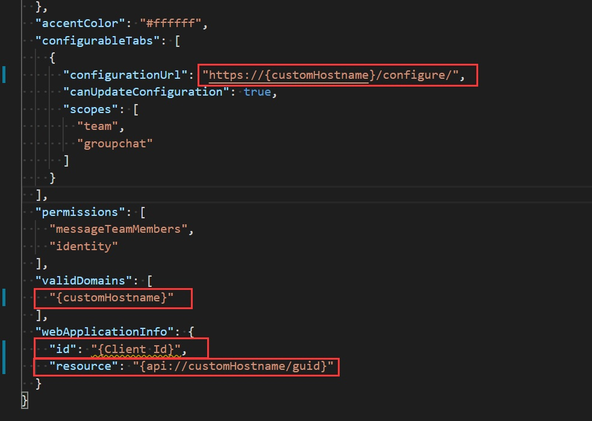

   - Save the file.
   - Run the script `PublishTeamApp.ps1` to package the Microsoft Teams App in the **manifest.zip** file.
   - Open the Microsoft Team App, click **Apps**, then click **Upload a custom app** and finally **Upload for {your company}**.
     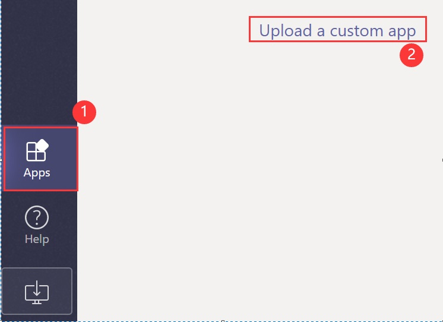
   
   - Upload the **manifest.zip** file.

1. Add the Apps to Microsoft Teams Tabs

   **First, deploy the Meeting Capture web app.**
   - Open Microsoft Teams **Apps** and search for Meeting Capture.  
   - Click **Meeting Capture Web.**  
   - Select **Add to a team**.  
      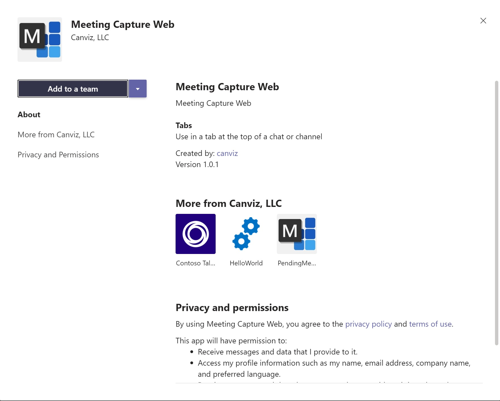
   - Select a channel and click **Set up a tab**.  
      
   - Configure the Tab according to the following screenshot, then click **Save**.  
      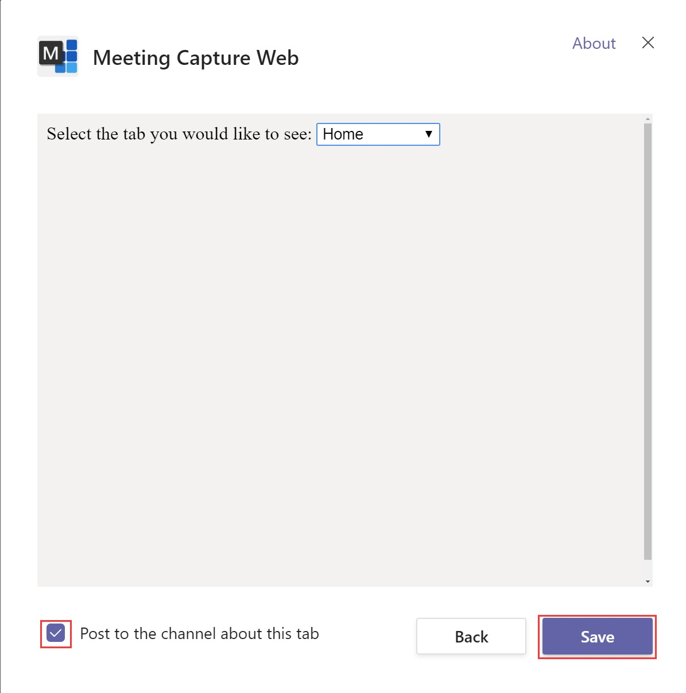
   
   **Next, deploy the Pending Meetings SPFx web part.**
   - Open Microsoft Teams **Apps** and search for PendingMeetings.  
   - Click **PendingMeetings**  
   - Select **Add to a team**.  
      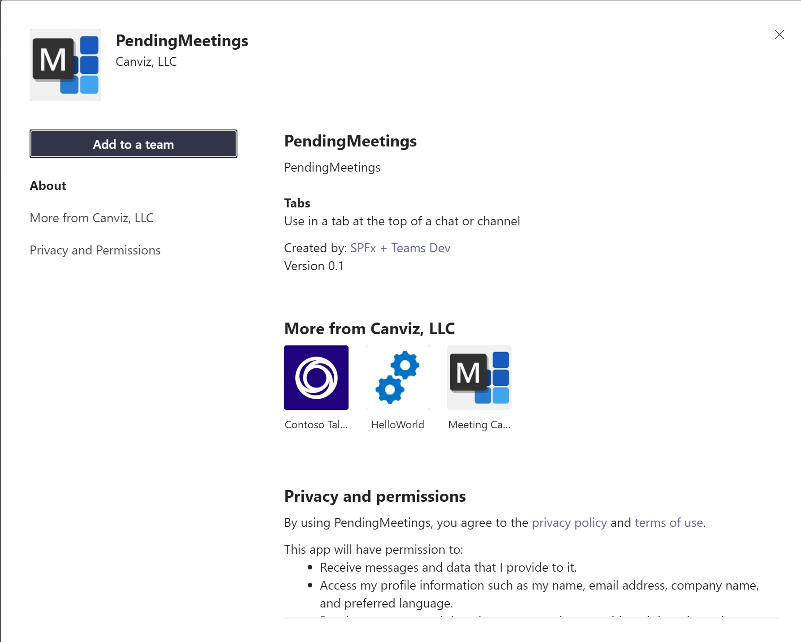
   - Select a channel and click **Set up a tab**.  
      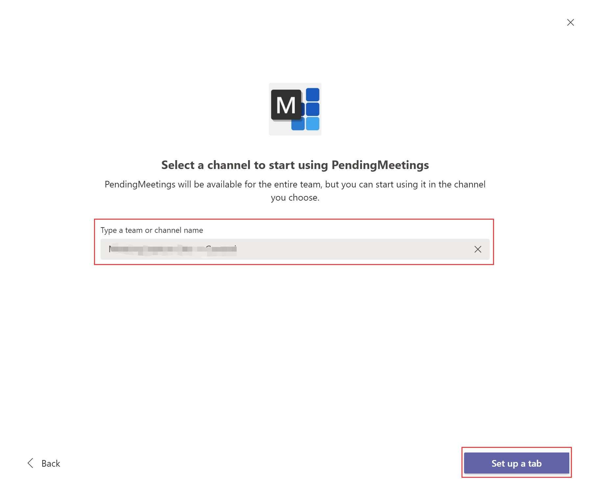
   - Configure the Tab according to the following screenshot, then click **Save**.  
      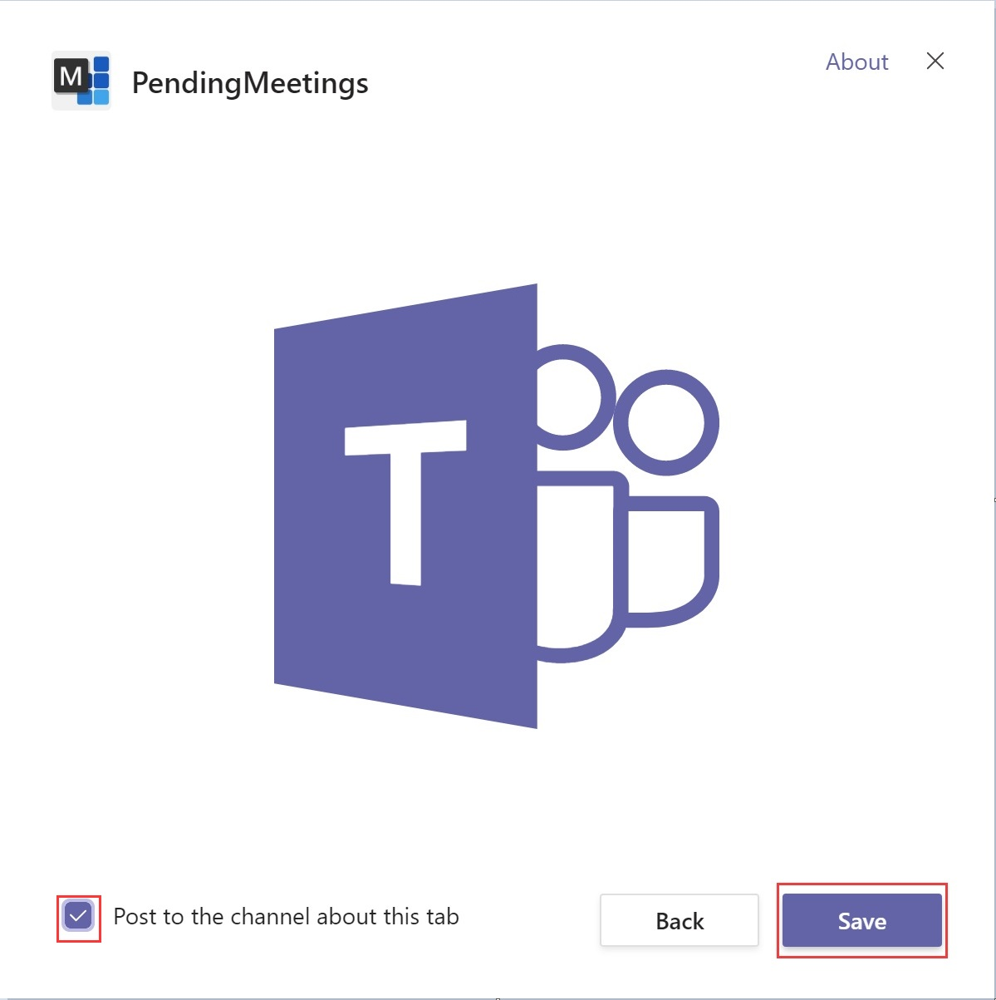

1. Compile and deploy SharePoint SPFx web part
   - Open the UpcomingMeetings.tsx file in a text editor.
   - On line 30, set the **targetId** variable equal to the Id for the Planner Plan in the Team and Channel where you installed the Teams app.
   - On line 31, set the **targetBucketId** variable equal to the Id for the Bucket inside the Planner Plan in the Team and Channel where you installed the Teams app.
   - **Save** the file.
   - In the command line, change to the **.\Source\SPFX\PendingMeetings** directory.
   - Run following commands to restore, build, and package the solution.
      ```cmd
      npm install
      gulp build
      gulp bundle --ship
      gulp package-solution --ship
      ```
   - Then run the following command to publish web part to Microsoft Teams.
      ```
      .\PublishWebpart.ps1   
      ```
      Please refer to the below table to enter the parameters:
   
      | **Name**                      | **Value**                   | **Description**                                              |
      | ----------------------------- | --------------------------- | ------------------------------------------------------------ |
      | **orgName**                   | \<orgName\>                 | The name of the tenant. If your SharePoint URL is http://contoso.sharepoint.com then your orgName is contoso. |
      | **adminUPN**                  | \<user\>@\<orgName\>.onmicrosoft.com | The site administrator account. For example: admin@contoso.onmicrosoft.com |
      
   The deployment is now complete! You are now ready to run the demo.

## Demo Script
 
Follow these steps to demonstrate how to use the sample and all of the features and functionality it provides.

### Note About Email Clients Used In Demo

We use the [Office365](https://outlook.office365.com/owa/service.svc/s/GetPersonaPhoto) service to get attendees photos, so please use [Office365](https://outlook.office365.com/) to open emails and see the profile pictures.

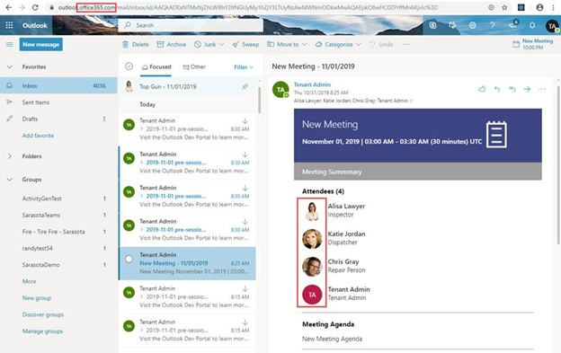

### Note about user accounts

This demo can be performed with 1 or more user accounts.  It's really up to the presenter.  In this demo script, user 1 is the person who sets up and attends the meeting and user 2 is a person who attends the meeting.

### First run experience (meeting setup)

 - Demo starts in a Channel in Microsoft Teams.
 - User 1 clicks the tab named Meeting Capture.
 - User 1 views the embedded web site. 
 - User 1 is prompted with a message:  No meetings are set up for this channel, do you want to make one?
 - If User 1 selects No then the popup closes and they see a screen with some text and a cool image in the middle with a create button.
 - User 1 selects Yes.
 - User 1 fills out a custom form in the web application to make the first meeting.
      - Enter a title for the meeting.      
      - The form allows the creator to assign attendees to the meeting.
      - By default, the people User 1 most frequently works with, who are members of the Team, are added as attendees.
      - Select a date and time for the meeting that works for all attendees.
      - Any or all the Team’s members can be removed before the form is submitted.
      - User 1 attaches documents that are considered pre-reads.  Each time a document is attached a task is created to read it before the meeting starts.  This is known as a pre-read task. Pre-read tasks are assigned to all meeting attendees, one task per document that is uploaded.

      > **Note:**  Do not upload files larger than 4MB.  See the Known Limitations section in this document for more information.

      - User 1 adds meeting agenda items in a structured list.
  - Upon form submittal a meeting event is created in Outlook, the documents are uploaded to SharePoint, and Tasks are created and assigned in Planner to do the pre-reading. 
  - Data is also written to the SQL Server Database.  For more information about the data and how to view it please see the **SQL Server Database Details** section in this document.
  - A Planner is created only once per channel and it contains all the tasks associated with all the meetings in the channel.
  - The content in the body of the meeting invite includes:
     - Agenda
     - Links to the tasks and who they are assigned to
     - Links to any attachments
- User 1 clicks the Save button and after everything is saved and published (described above) the user is taken to a different page with a list of the meetings created in the channel.  When a user selects one of the meetings in the list the web app takes the user to the page where they can capture notes for the meeting.

### Before the meeting occurs

#### Reminders to complete pre-read tasks

The system automatically reminds people to complete their pre-read tasks.

- An Azure Web Job continually checks to see if you have any pre-read tasks you have not completed.
- It sends a message to remind you to complete the pre-read tasks.
- The email is sent 1 day in advance of the meeting starting.  The number of days is a configurable setting.
- User opens email in Outlook mobile in a web browser and sees an actionable message that includes a link to a pre-read document (PowerPoint presentation).

#### Prepare for meeting by completing tasks

Users can easily access pre read tasks to prepare for the meeting.

- User 1 opens Teams in a mobile device and loads the Pending Meeting Tasks SPFx app web part on a SharePoint Page in a Teams tab named Pending Meeting Tasks and sees the upcoming tasks associated with their meetings.
- User 1 selects the upcoming meeting and sees all of the tasks associated with the meeting displayed.
- User 1 clicks the button to filter the tasks so only User 1’s tasks are displayed.
- User 1 opens a SharePoint page on their Intranet where the same Pending Meeting Tasks SPFx web part is displayed and the same actions can be performed.

### During the meeting

Once the meeting begins, users can capture notes and assign tasks related to the meeting.

 - User 1 opens Teams and clicks the Meeting Capture Tab that contains the embedded web site.
 - User 1 sees details for the current meeting including:
    - Files in the SharePoint site associated with the Team
    - Notes in the OneNote associated with the Team
    - Tasks from the Planner associated with the Team.
 - User 1 creates notes.
 - User 1 creates tasks.
 - User 1 saves and publishes the information captured in the web app.
 - The system sends an email with all of the captured meeting information to all meeting attendees and all people who were assigned tasks.
 - The system publishes the notes and tasks to OneNote and Planner.
 
 ### After the meeting
 - User 1 or 2 receives an email summary of the meeting and opens it and reviews all the content.
 - User 1 or 2 clicks links in the email that demonstrate the published data has been put into OneNote, and Planner.
 - User 1 or 2 can return to the Meeting Capture Tab at any time to review the meeting, notes, tasks, and documents.
 - User 1 schedules a follow up meeting by following the same process described above to create a meeting.

## Appendix

### How to delete demo data

To delete demo data open the menu for the Meeting Capture tab and select Settings.  
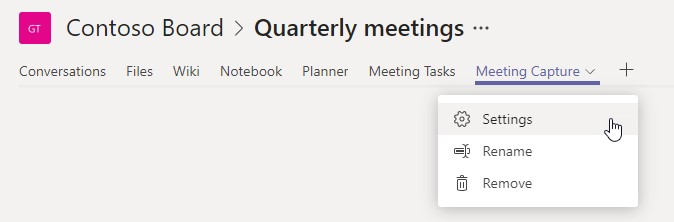
In the dropdown list, select Delete Events.  
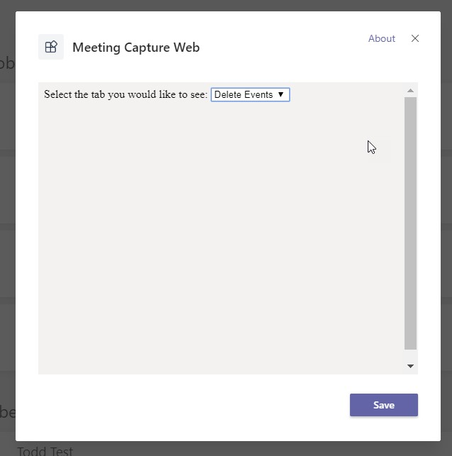

The page will refresh and show you a list of all the meetings.  Click the delete button next to a meeting to delete it.  When you delete a meeting EVERYTHING associated with it in the demo is deleted (Outlook, Planner, Files, SQL).

You can also add another tab with the Delete Events option selected if you want one tab for the Meeting Capture app and another tab to delete events.

### How to add the ASP.NET MVC Web App to a Tab in a different Team and Channel

1. Open Teams, you can open online teams: https://teams.microsoft.com or local Teams App.
1. Select **Teams**, click **Join or create a team**, then select **Create Team.**  
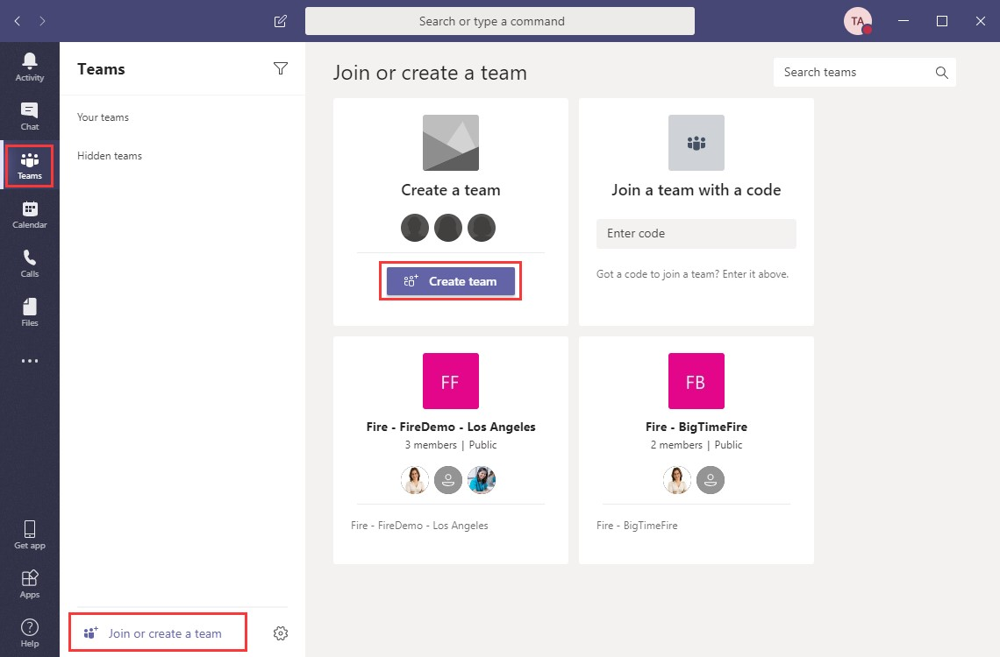
1. Select **Build a team from scratch**.  
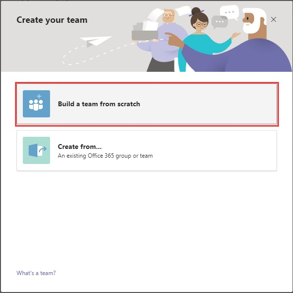
1. Select **Public** kind.  

1. **Type** a team name and click **Create** button.  
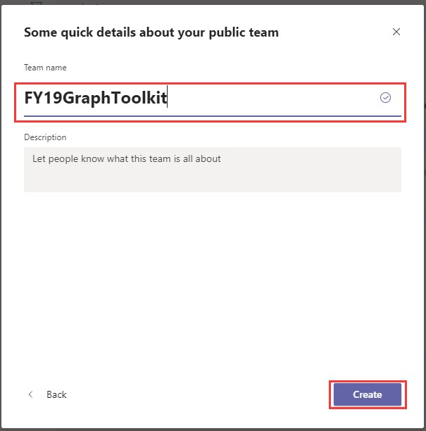
1. Add members to teams and click **Add** button, then click **Close** button.  
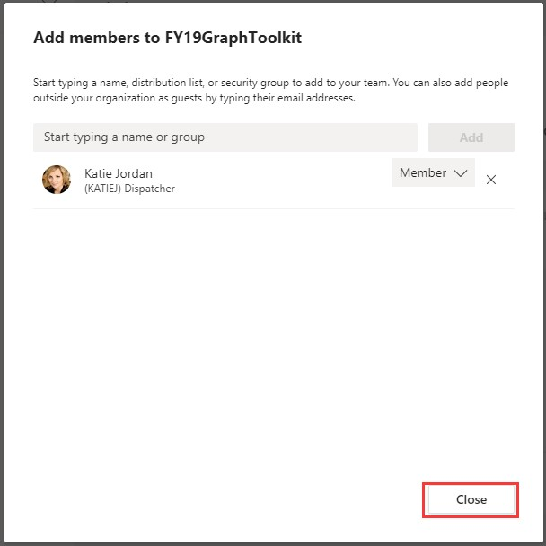
1. A new Team has been created successfully.  
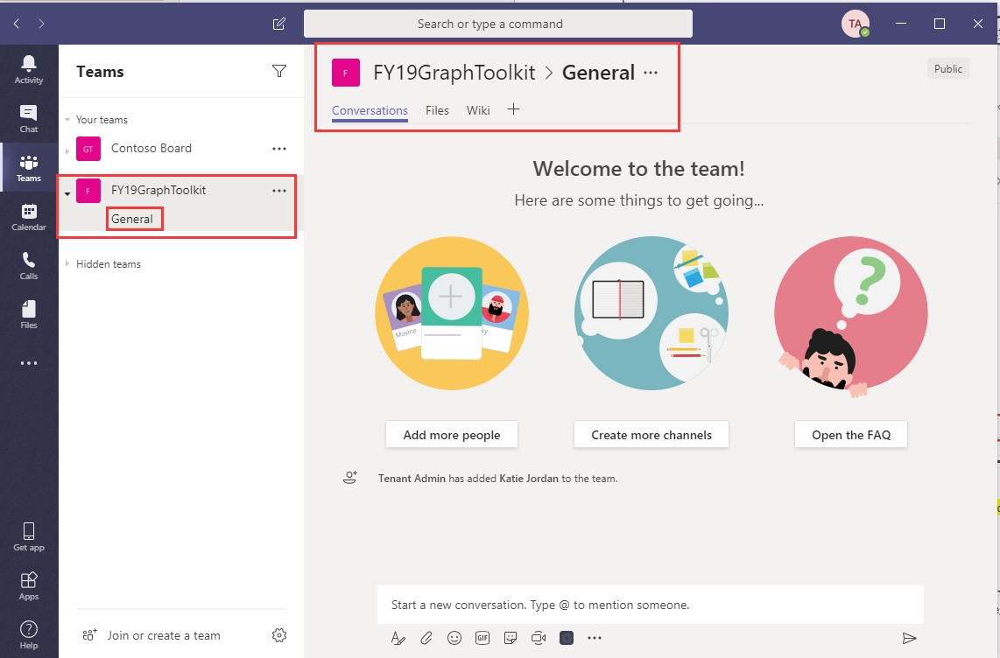
1. Select the Team and click **Add channel**.  
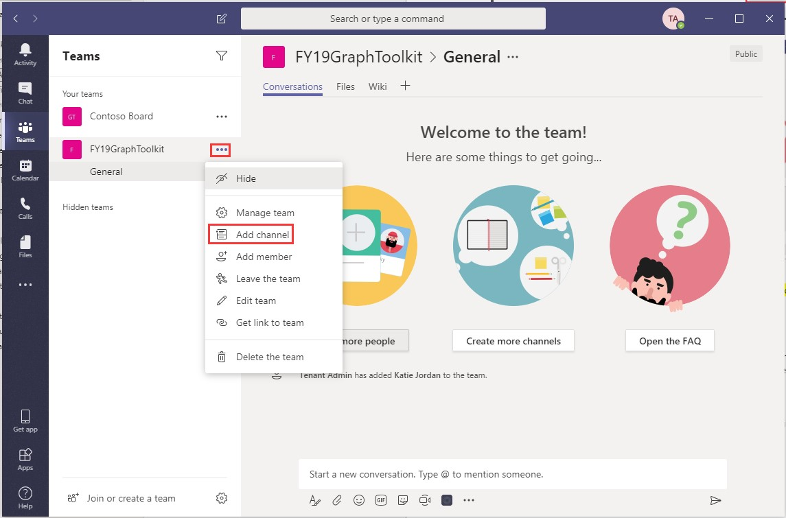
1. Type a Channel name, select the checkbox and click **Add** button.  
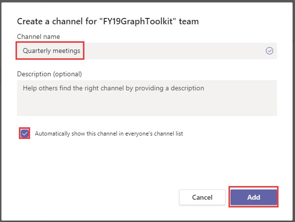
1. A new Channel has been added successfully.  
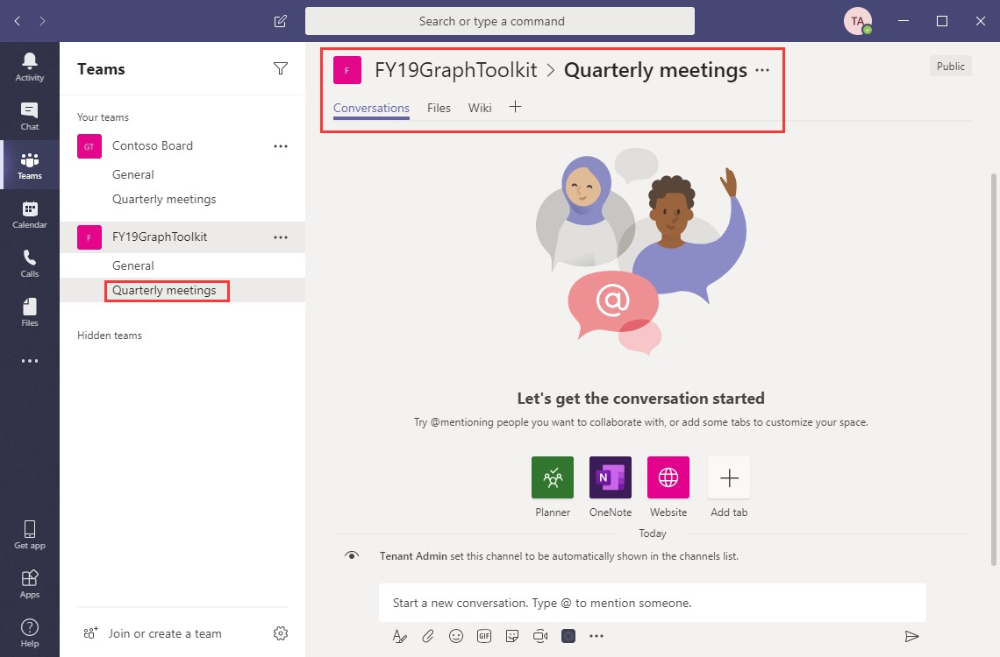
1. Download the team tab [manifest.json](./FY19GraphShowcaseDemo/MeetingCaptureWebApp/Manifest/manifest.json) file.  
1. Open Teams **Apps**, search App Studio.  
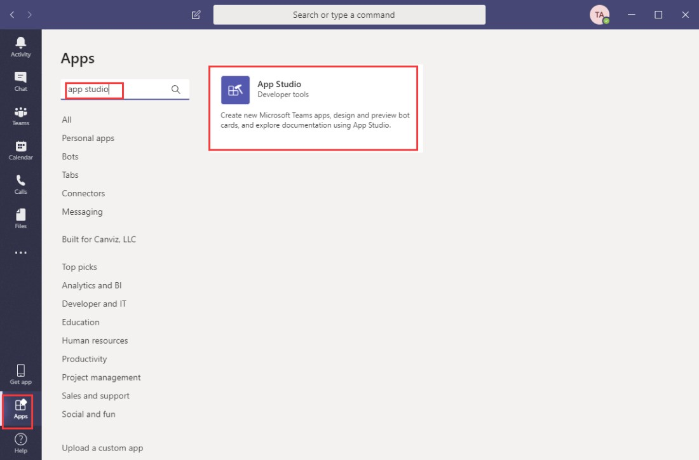
1. Find App Studio in the App Marketplace.  Install it if you don’t have it.  Click App Studio and Click Open button.  
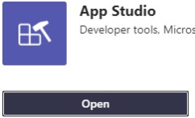
1. Select Manifest editor and **Import an existing app**.  
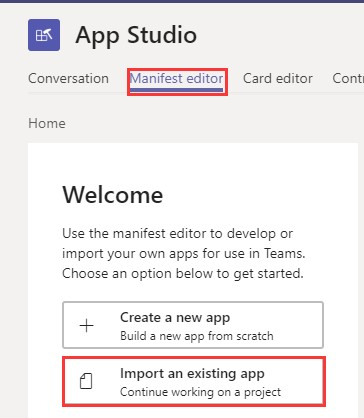
1. Select manifest.json that you download above.  
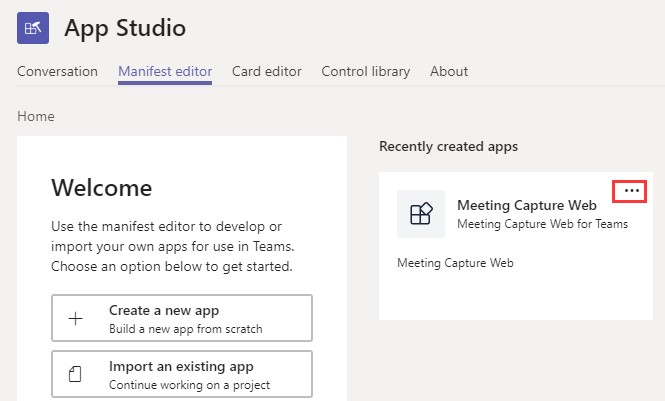
1. Select **Meeting Capture Web.**  
1. Click **Test and distribute** and click **Install** button.  
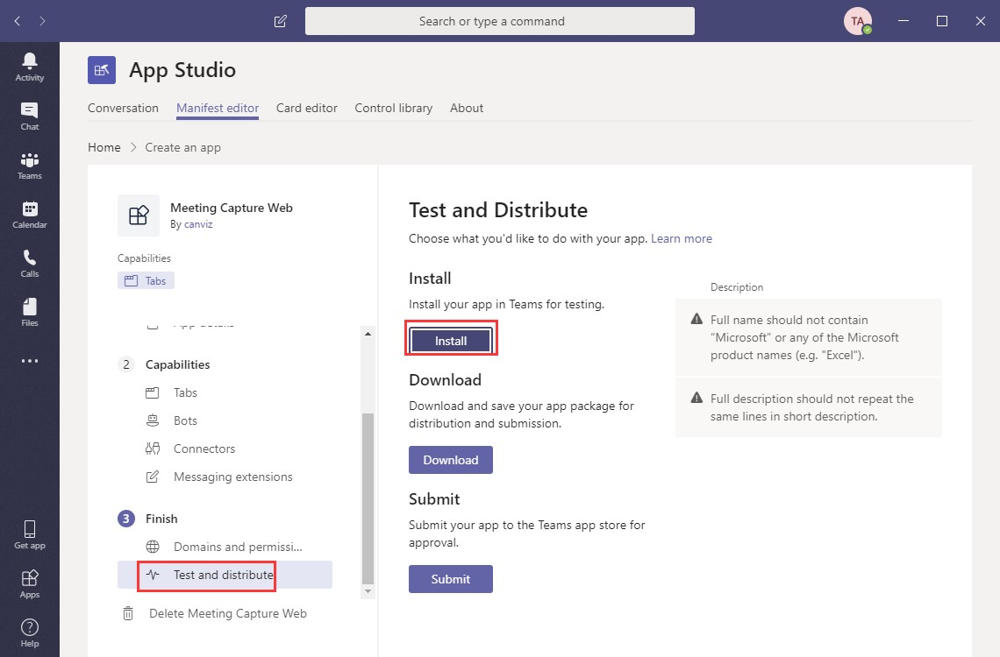
1. **Select Add** to a team.  
1. Select a channel and then click **Set up a tab**.  
1. Select the Home value in the dropdown list, then click the **Save** button.
1. Done.  

### Microsoft Graph Toolkit - Controls and Proxy Provider
In this sample we use the [Graph Toolkit Controls](https://github.com/microsoftgraph/microsoft-graph-toolkit) wherever possible.  You will see them in both the ASP.NET MVC Web Site and in the SPFX web part.  By default, Graph Toolkit Controls make client side Graph API calls.  In this sample, the Graph Toolkit controls use the Proxy Provider that allows it to use the .NET SDK to make server side calls to Graph.  We took this approach because we did not want to have some of the application's calls to Graph client side and some of them server side.  This pattern makes the Graph API access pattern consistent.  You do not have to use the same approach we used in this sample, it is OK to skip the proxy and instead have both client side and server side calls to the Graph API in your code.  It's up to you.

Learn more about the Graph Toolkit Controls and the Proxy.

### SQL Server Database Details
The SQL Server Database supplements the application and stores information about meeting agenda items, attendees, meetings, files associated with tasks, and channels.

  - If you would like to browse the data in the database, follow these steps.
     - Login to the [Azure Portal](https://portal.azure.com). 
     - Find the resource group the script created and open it.
     - In the resource group, locate the SQL database and click it.

         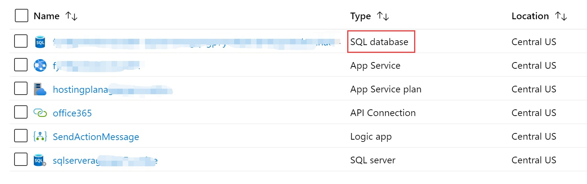
     - Click **Query editor(preview)** and login to the SQL server with the **sqlAdministratorLogin** and **sqlAdministratorLoginPassword** parameters you set in the `ARMParameters.json` file.

         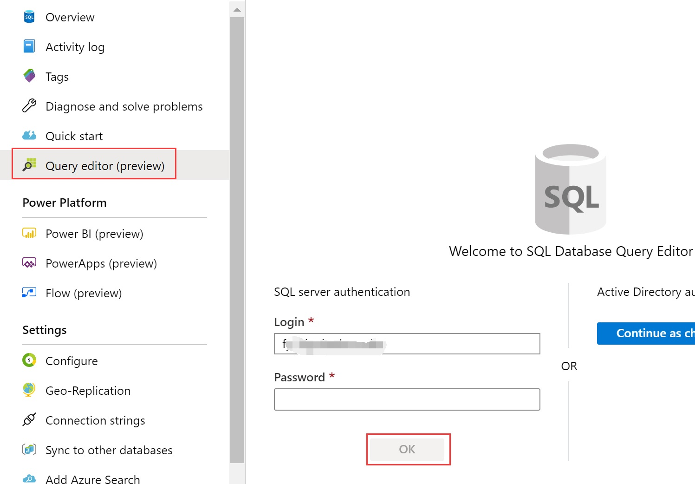
     - Expand the **Tables** node to see the different tables in the database.
         - Agendas
         - Attendees
         - Meetings
         - TaskFiles
         - TeamChannels

         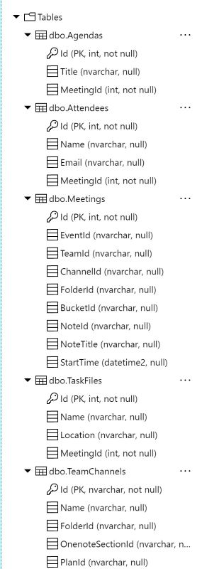

### How default attendees are added to new meetings
In the Meeting Capture web application, on the new meeting creation page, we implemented some custom business logic to add the default meeting attendees.  Essentially, we wanted to invite the people who the meeting organizer works with the most, but only if they are a member of the Team.  We also wanted to ensure no duplicates were added.  To implement this we used the Microsoft Graph API.  Here's what the logic looks like at a high level.

1. Get the top 50 people the meeting organizer works with on a regular basis.
2. Get all the members of the current Team.
3. Select the top 5 people that exist in both the datasets returned in steps 1 and 2.
4. If the current user is not in the list, add to the attendees list.
5. When adding an attendee from the UI, first determine if the person exists in the current attendees list. If the person does not exist in the list, then add them.

### Known Limitations
- The SharePoint upload document API use in this sample can only upload files less than 4MB.  For files larger than 4MB, a more complicated method is needed, it is explained here.  https://docs.microsoft.com/en-us/graph/api/driveitem-put-content?view=graph-rest-1.0&tabs=http 
